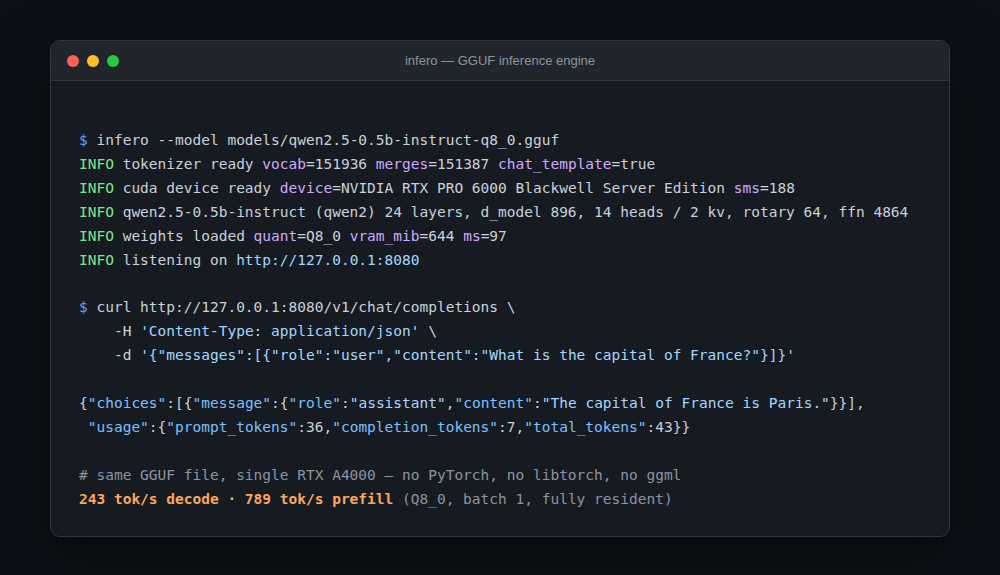

# infero

[English](README.md)

一个用 Rust 编写的推理引擎，支持 GGUF、AWQ 和 FP8（W8A8）三种 checkpoint，
内核为 NVIDIA（CUDA）和 Apple Silicon（Metal）两种 GPU 都手写了实现——不
依赖 PyTorch、不依赖 `libtorch`、也不依赖 ggml。CUDA 是主要的、最完整的
后端；Metal 目前覆盖了稠密解码、GQA 注意力和 GatedDeltaNet，而 MoE、视觉
塔，以及 INT4/FP8 张量核心 GEMM 路径仍然只有 CUDA 有（见下文
[Metal](#也支持-apple-gpumetal) 一节）。从磁盘上的一个模型 checkpoint 到
一个兼容 OpenAI 的 HTTP 响应，整条链路都在这个仓库里。

<p align="center"></p>

官方 `openai` Python SDK 不用改动就能直接对接，流式输出也支持。

## 现状

可以在单张 GPU 上运行 Qwen2、Llama 系列、Qwen3-MoE 的 GGUF 模型,以及
AWQ 量化和 FP8(W8A8)量化的 Hugging Face checkpoint。正确性不是靠肉眼
观察,而是对照参考实现逐项校验的:分词器与 Hugging Face 做逐 token
比对,量化解码器与同一 checkpoint 的 F16 版本比对,前向过程与
`transformers` 的 logits 比对。

KV 缓存可以用 TurboQuant 压缩;这套压缩在这个模型上实际能换来什么,见下文。

请求通过分页 KV 缓存上的连续批处理(continuous batching)提供服务,层也
可以卸载到主机内存以便让模型塞进更小的显存里,而且已完成的 prompt 前缀
会跨请求缓存,一段共享的 system prompt 或一场多轮对话只需要为新增的
token 付费。

**不只是纯文本解码:**

- **MoE。** 稀疏 FFN 架构(Qwen3-MoE 及同类)会逐个专家加载——每个专家
  独立 AWQ 量化——解码时走一个专门的 top-k 路由内核,预填时走
  计数排序后逐专家 GEMM 的路径。
- **视觉与视频。** Qwen3.5-VL 风格的 checkpoint 可以在同一个
  chat-completions 接口里接收 `image_url` 和 `video_url` 内容分片,用
  M-RoPE 处理由此产生的三轴位置编码,视觉占位符 token 会跨 step 分块
  预填,长视频还有内容感知的 token 剪枝
  (`crates/model/src/qwen35_vision*.rs`,`crates/server/src/video.rs`)。
- **投机解码。** GGUF 内嵌或旁挂(sidecar)的 MTP 头会在主模型前面预先
  起草 `k` 个 token;`INFERO_SPEC_K` 控制起草深度,设成 `0` 就是关闭
  (`crates/model/src/spec.rs`)。
- **工具调用。** 支持 OpenAI 风格的 `tools`/`tool_choice`,会从模型自己
  的输出里扫描出 `<tool_call>` 标签,转成结构化的 `tool_calls` 返回,
  流式场景也支持(`crates/server/src/tool_call.rs`)。

**暂不支持:** 分片 GGUF 文件(`*-00001-of-0000N.gguf`)、多 GPU、GPU 端
采样、原生 NVFP4/GPTQ checkpoint。

**精确意义上的 batch 不变性。** 有两条性质是严格成立、并且在测试里断言而非
假设的:

- 一个请求的 logits 不依赖于*同一批次里还有哪些其他请求*
  (`a_batch_does_not_leak_between_its_members`)。
- 张量核心 GEMM 在任意 batch 宽度下都给出逐位相同的结果,所以在每种行数下
  都会用到它的词表投影(vocab projection)是不变的
  (`tensor_core_gemm_gives_the_same_answer_at_any_batch_size`)。

不成立的地方:层投影会在单 token 步和多 token 步之间切换内核,因为在单 token
时,整数矩阵-向量乘(mat-vec)在 Q4_K 上比张量核心 GEMM 快 1.9 倍,在 Q6_K 上
快 3.2 倍。把它们统一起来会在单请求延迟上付出这么大的代价——而这正是这个
引擎存在的意义所在,所以这个切换保留了下来。两种内核对 `k` 求和的顺序不同,
所以贪心解码在极小概率差距的情况下最终可能会选到另一边——在四个 prompt 上
测得约每八个 token 出现一次。带温度的种子采样在固定 batch 宽度下是可复现的,
跨 batch 宽度则不是。

## 快速开始

```bash
./scripts/setup-cuda.sh                     # 把 CUDA 用户态库链接到 vendor/ 下
mkdir -p models && cd models
curl -LO https://huggingface.co/Qwen/Qwen2.5-0.5B-Instruct-GGUF/resolve/main/qwen2.5-0.5b-instruct-q8_0.gguf
cd ..

cargo run --release -p infero-server -- --model models/qwen2.5-0.5b-instruct-q8_0.gguf
```

自带一个终端客户端:

```bash
cargo run --release -p infero-tui -- --host 127.0.0.1:8080
```

token 到达即流式显示,展示每条回复的 tok/s,`esc` 可以在生成过程中随时取消——
这会断开连接,调度器会在下一步中把这个序列从批次里退出,而不是把它生成完再
丢弃。它说的是标准的 OpenAI SSE,所以能对接任何提供这套 API 的服务。

还有一个用于单次生成的 CLI,当某个地方看起来不对劲时,这是排查的起点:

```bash
cargo run --release -p infero-model --example generate -- \
    models/qwen2.5-0.5b-instruct-q8_0.gguf "Explain RoPE in one sentence." --greedy
```

以及一个 GGUF 检查工具:

```bash
cargo run -p infero-gguf --example info -- models/qwen2.5-0.5b-instruct-q8_0.gguf --tensors
```

### 也支持 Apple GPU（Metal）

`infero-gpu` 是一个很薄的设备层 trait，`infero-cuda` 和 `infero-metal`
各自实现一份；编译时只会链接进其中一个，靠 feature flag 选择，而不是
运行时分支：

```bash
cargo run --release -p infero-server --no-default-features --features metal -- \
    --model models/qwen2.5-0.5b-instruct-q8_0.gguf
```

Metal 后端在设计上刻意对齐了 `cudarc` 自己的形状——`Buf`、`View`、
`ViewMut`、`LaunchConfig`,方法名、参数顺序都一样——所以 `infero-kernels`
里那 160 处内核启动点完全不用改一行代码就能对着它编译;不同的只是下面
那层设备实现。内核是逐文件移植的:`ops.cu` → `ops.metal`,`quant.cu` →
`quant.metal`,`gdn.cu` → `gdn.metal`,`mmvq.cu` → `mmvq.metal`,以此类推;
`unimplemented.metal` 顶替那些还没移植的部分,所以一个缺失的内核会在
pipeline 构建阶段就报错,而不是悄无声息地跑出垃圾结果。

目前 Metal 上能跑的:F16 和 Q8_0 解码、整数 mat-vec、一个融合式的 GQA
解码注意力内核、GatedDeltaNet、主机端采样,以及 M-RoPE——这些都用 CUDA
路径同样的 CPU 参考实现和 logits fixture 做过校验。还没移植的:类张量
核心的整数 GEMM(`mmq.cu` 和 `vendor/marlin` 都没有 MSL 对应版本——
Apple GPU 没有可以对标的等价矩阵乘法指令形态)、MoE、视觉塔、FP8
(Apple GPU 没有 FP8 矩阵单元),以及 TurboQuant KV 压缩。这些目前都停留
在 `#[cfg(feature = "cuda")]` 后面,没有在 Metal 上伪造出来。设计笔记
和最初实测的起点记录在
`docs/superpowers/specs/2026-08-23-infero-metal-port-design.md` 里。

### 不需要 CUDA 工具链

这里没有 `nvcc`,也没有 `/usr/local/cuda`——只有驱动。内核由 NVRTC 在运行时
编译,`scripts/setup-cuda.sh` 会把 `vendor/cuda` 链接到 PyTorch 本来就会拉取
的 pip `nvidia-*` wheel 里所附带的 CUDA 用户态库上。如果想用真正的工具链,
设置 `CUDA_HOME` 即可。

由于这些库不在系统搜索路径上,`infero-cuda` 在启动时会用绝对路径加上
`RTLD_GLOBAL` 打开它们;`dlopen` 按 soname 去重,所以 cudarc 之后按裸名查找
时能找到它们。正是这个技巧让 `libnvrtc-builtins.so` 不需要 `LD_LIBRARY_PATH`
就能被解析到。

## 项目结构

| crate | 作用 |
| --- | --- |
| `infero-gguf` | GGUF 容器:文件头、元数据、张量索引。mmap 映射,零拷贝。 |
| `infero-cuda` | 设备、流、cuBLAS 句柄,带 PTX 磁盘缓存的 NVRTC 编译。 |
| `infero-kernels` | `.cu` 源码及其启动封装。 |
| `infero-tokenizer` | 基于 GGUF 词表构建的字节级 BPE,以及聊天模板。 |
| `infero-model` | 配置、权重上传、前向过程、KV 缓存、采样。 |
| `infero-server` | 连续批处理调度器,以及兼容 OpenAI 的 HTTP API。 |
| `infero-tui` | 终端聊天客户端。手写的 HTTP 实现,任何代理环境变量都无法重定向本地回环请求。 |

一个解码块:

```
x ──► rms_norm ──► q,k,v = W·x + b ──► rope ──► store kv
│                                        │
│                            attention over the cache
│                                        │
└────────────────► + ◄── W_o · attn ─────┘
                   │
                   ├──► rms_norm ──► silu(W_g·x) * (W_u·x) ──► W_d·
                   │                                            │
                   └──────────────────► + ◄──────────────────────┘
```

### 设计说明

**权重在解码过程中永远不会在设备上被反量化。** 它们始终保持在 GGUF 的
分块编码里,就地被消耗。这正是量化模型在显存中比在磁盘上更小、而不只是
磁盘更小的全部原因。

**解码走的是整数路径。** 激活行被量化为 Q8_1,然后用 `__dp4a` 与打包后的
权重做点积,一条指令处理四个权重和四个激活,全程不产生浮点数中间值。
各类型的点积运算是从 llama.cpp 的 `vecdotq.cuh` 移植过来的(MIT 协议——
见 `vendor/LICENSE.ggml`);启动器和激活量化器是我们自己写的。这是值得
直接借用而不是自己重新推导的:在 Llama-3.1-8B 上这带来了 9 倍的差距,而
之前三轮对浮点内核的猜测式优化只换来了 1.8 倍。

**批处理走的是整数张量核心。** 一次批量投影就是一个 GEMM,`mmq` 直接在
量化权重上运行它:每 32 元素量化组一次 `mma.m16n8k32.s8`,分块 scale 之后
再以浮点形式并入。K=32 不是一个调优选择——每个 ggml 分块本身就是 32 个
元素宽,所以一次 MMA 恰好消耗一个分块,scale 也就永远不会跨越一个累加器。
这个结构沿用了 llama.cpp 的 `mmq.cu`,vLLM 的 GGUF 路径也是照搬这一套。
Q6_K 需要每*十六*个元素一个 scale,一次 MMA 覆盖不了;不过其片段(fragment)
布局恰好把寄存器 0/1 放在 `k ∈ [0,16)`、2/3 放在 `[16,32)`,所以把 B
操作数的一半清零就能隔离出一个 scale 组。

这些片段布局由一个测试(`crates/kernels/tests/mma.rs`)钉死,它把 one-hot
的 MMA 输入与整数参考结果对照,因为这里的索引哪怕只差一位,产生的矩阵积
在余弦相似度测试里看起来仍然合理,却会毁掉生成结果。

**什么时候用哪个内核。** 单 token:整数矩阵-向量乘(`mmvq`)。2 到 96
token:张量核心 GEMM(`mmq`)。超过这个范围后,`mmq` 每个 token tile 都要
重新读一遍权重,读得足够频繁以至于反量化到 f16 暂存区再调用 cuBLAS 反而
更划算。对于某个类型只有 mat-vec、没有 GEMM 的矩阵,会把 mat-vec 按 token
重复调用,最多到十二个 token——浮点版 `gemv` 每个线程解码一个权重,运行
速度比内存带宽上限低一个数量级,所以哪怕重复十几遍也比它划算。这两个阈值
都是在 A4000 上实测得出的,不是推导出来的;`INFERO_MMQ_TILES` 和
`INFERO_NO_MMQ` 就是为了重新测量它们而存在的。

词表投影在*任何*行数下(包括 1)都使用 `mmq`。这看起来像是在牺牲吞吐量,
实际正相反:这正是让 logits 独立于 batch 宽度的关键,而 profile 显示它所
替换掉的浮点 mat-vec 曾占到一个 batch-32 解码步骤的 59%。

**激活值是 f32,KV 缓存是 f16。** 让激活值保持较宽的位宽,会占用一部分
llama.cpp 风格引擎宁愿花在别处的带宽,但这样一来每个中间结果都能直接与
CPU 参考实现对比——而找出一个错误的 RoPE 约定,恰恰需要这个能力。

**采样在主机端进行。** 每个 token 传输一次 600 KB 的 logits,相对于前向
过程来说是舍入误差级别的开销,而这样做能让惩罚项的记账留在普通的 Rust
代码里。

### 连续批处理

请求共享 GPU。每一步都从当前所有在途请求里组装一个批次,运行一次前向
过程;完成的序列在这一步结束时离开,等待中的请求在下一步开头顶上它的
位置,其他一切都不会因此暂停。

```bash
infero --model model.gguf --max-seqs 32 --kv-slots 32768
```

两条规则决定一个批次的组成。**解码优先**——它们每个只花一个 token 的
代价,而一个正在运行的序列如果被别人的 prompt 饿住,客户端是能感受到
这个卡顿的。**prefill 填充剩下的空间,并且可能被拆分**到多个步骤里,
这正是防止一个 4000 token 的长 prompt 冻结所有其他人的机制。

**KV 缓存是分页的**,页大小为一个 token。序列从一个共享池里取用页槽,
并维护一张把逻辑位置映射到物理页槽的表,所以长度可以千差万别,已完成的
序列立刻归还它的页槽,接纳一个新序列的代价只是一次表写入而不是一次
分配。页大小为一意味着完全没有内部碎片;这张表每个缓存 token 花费四
字节,相对于这个模型每个 token 本身约 24 KB 的开销来说微不足道。更大
的页会为注意力循环带来更好的局部性,是显而易见的下一步。

批处理是一个调度决策,不是一个数值决策,测试也是这么要求它的:四个
序列一起解码,产生的输出与各自单独解码时逐 token 完全一致;一个中途
加入某个批次的序列,不会受到批次里其他成员的影响。

### CPU 卸载

`--gpu-layers N` 让 `N` 个块留在显存里,其余的移到锁页主机内存,按层
流式传回:

```bash
infero --model model.gguf --gpu-layers 12       # 12 个块常驻,其余流式传输
infero --model model.gguf --gpu-layers 0        # 只有嵌入层和词表头保留在显存
```

**计算永远不会离开 GPU。** 这和 llama.cpp 的 `-ngl` 不同,后者会把卸载的
层放到 CPU 上运行,需要为每种量化格式再实现一套内核。这里移动的是权重,
算术运算的位置不变,所以卸载换来的是用 PCIe 带宽换显存,而不是用 GPU
吞吐量换 CPU 吞吐量——并且每种内核只需要一份实现。

一层里那七个大矩阵被打包进一整块锁页内存,所以暂存一层是一次连续的
DMA,而不是七次。两个暂存槽按层的奇偶性交替使用:计算流读取槽
`L % 2` 的同时,拷贝流填充槽 `(L+1) % 2`,双向都有事件同步——
`ready[s]` 让计算等待传输落地,`consumed[s]` 让下一次传输等待计算完成。
norm 和 bias 始终常驻;它们只有几 KB 大,流式传输它们只会增加描述符
开销,没有任何收益。

因为改变的只是路径,结果不会因此改变:`cargo test -p infero-model
--test offload` 断言在 0、1、12、23 个常驻层的情况下,logits 与完全
常驻运行**逐位相同**。

### KV 缓存:TurboQuant

缓存可以用 [TurboQuant](https://arxiv.org/abs/2504.19874)(Zandieh 等,
Google Research,ICLR 2026)压缩,这是直接照论文实现的:

- **算法 1,`TurboQuant_mse`**——一次随机旋转 `Π` 会把任意单位向量变得
  在球面上均匀分布,于是它的坐标就会遵循*已知*的密度
  `f_X(x) ∝ (1-x²)^((d-3)/2)`,无论输入是什么。正是这一点让一个最优
  标量量化器可以离线求解一次,不需要任何校准数据。
  `crates/kernels/src/turboquant.rs` 对每个 head 维度数值求解公式 (4);
  得到的失真值与 Max 的 Lloyd-Max 表精确到四位有效数字都能对上
  (b = 1..4 时分别为 0.3634 / 0.1175 / 0.03454 / 0.009497),这正是
  定理 1 引用时四舍五入后的数值。
- **算法 2,`TurboQuant_prod`**——一个 MSE 最优量化器会*压缩*内积,所以
  key 会用 `b-1` 位的 MSE 编码再加一个 1 位 QJL 符号编码残差,这样能让
  注意力 logit 保持无偏。在内核上实测:仅用 MSE 的估计器回归到真值时
  斜率是 0.885,两阶段方案的斜率是 1.003。

key 用算法 2,value 用算法 1——key 参与的是内积,value 参与的是加权
平均。

**一切都停留在旋转后的基底里。** `Π` 是正交的,`S` 是独立同分布的
高斯分布,所以 `S' = S·Πᵀ` 也是,于是估计量变成:

```
<q, x~> = <Πq, y~> + (sqrt(pi/2)/d) · gamma · <S'(Πq), qjl>
```

query 每个 token 只旋转一次,并且**没有任何缓存向量会被旋转回去**。
对于 value,同样的换元把逆旋转从每个缓存向量一次,变成了每个
(head, token) 一次——发生在加权求和之后。没有这一步,整套方案就不
值得跑。

尚未实现的部分:论文里的离群通道拆分(outlier-channel split),它是
论文里非整数的 2.5 位和 3.5 位速率的来源(在 `d = 128` 上,32 个通道
用 3 位,96 个通道用 2 位)。这里用的位宽是 2、4、8,以便编码能整齐
打包进字节。

```bash
infero --model model.gguf --kv-quant k8v4     # key 8 位,value 4 位
infero --model model.gguf --kv-quant tq4      # 论文里的对称 4 位方案
```

预设 `tq2` / `tq4` / `tq8` 是带 QJL 的对称方案,`tq2-mse` / `tq4-mse`
去掉了 QJL 阶段,`k<bits>v<bits>[+qjl]` 则可以分别独立设置两侧的位宽。

### 支持的权重编码

`F32`、`F16`、`Q4_0`、`Q4_1`、`Q5_0`、`Q5_1`、`Q8_0`、`Q4_K`、`Q6_K`。

| | 整数 mat-vec | 张量核心 GEMM |
| --- | --- | --- |
| `Q8_0` | 支持 | 支持 |
| `Q4_K` | 支持 | 支持,行数需为 256 的倍数 |
| `Q6_K` | 支持 | 支持,行数需为 256 的倍数 |
| 其他 | 不支持 | 不支持 |

其余的会退回到浮点 mat-vec,或者反量化 + cuBLAS。给 mat-vec 添加一种
新类型,意味着要移植它的 `vec_dot_*_q8_1`;给 GEMM 添加一种新类型,
意味着要写一个暂存函数,把它的分块展开成 int8 tile,并为每 16 或 32
元素一组配一个 scale。

### 支持的架构

旋转位置编码(rotary)的配对方式取决于架构,而这一点并不记录在文件
里:llama 系列的转换脚本会置换 Q 和 K,使*交错*配对能复现 Hugging Face
的 rotate-half,而 Qwen2 要用的是 NeoX 方式。配错了不会报错,只会得到
流畅但随位置漂移的输出——这也正是它被发现的方式。Llama 3.1 还额外
携带了 `rope_freqs.weight`,一个为其 128k 上下文准备的、按维度设置的
频率除数,它的聊天模板会自己发出 `{{ bos_token }}`。

一个 "Q4_K_M" 文件其实是混合编码的。Qwen2.5-0.5B 的隐藏层维度 896 不是
256 元素的 K-quant 超级分块的倍数,所以它大多数行都会退回到
`Q5_0`——这也是为什么那些老式的 block-32 量化格式不是可有可无的。

## 正确性

`cargo test` 运行 139 个测试。需要模型文件的测试,在 `models/` 为空时
会干净地跳过。

| 内容 | 校验方式 |
| --- | --- |
| 分词器 | 在 25 个用例(中日韩文字、emoji、代码、连续空白)上与 `AutoTokenizer` 逐 token 比对。聊天模板输出逐字节比对。 |
| 量化解码器 | 每种编码的 mat-vec 与同一张量的 F16 版本比对。Q4_K 余弦相似度 ≥ 0.997,Q8_0 ≥ 0.99998。 |
| TurboQuant | 码本失真与 Max 的 Lloyd-Max 表比对,精确到四位有效数字;在量化数据上实测的失真与码本预测值比对;证明仅用 MSE 的估计器会压缩内积,而两阶段方案不会。 |
| CPU 卸载 | 在 0、1、12、23 个常驻层下,批处理与逐 token 两种方式,logits 均与完全常驻运行逐位相同;每个卸载层每次前向恰好一次传输。 |
| 连续批处理 | 四个序列一起做 prefill,与各自单独 prefill 产生完全相同的 logits;交换一个请求的批次伙伴,它自己的 logits 逐位不变;中途加入的序列不受影响;回收的池槽不携带上一个使用者的历史记录。贪心解码要求在八步中至少五步与单独解码的轨迹一致——为什么不是全部八步,见上文关于 batch 不变性的说明。 |
| 张量核心 GEMM | `mma.m16n8k32.s8` 的片段布局与整数参考结果比对钉死,包括能把一个映射错误的索引定位到单个格子的 one-hot 输入。在 1、5、16、19、33、64 个 token 下,Q8_0、Q4_K、Q6_K 与浮点 mat-vec 的逐张量余弦相似度 ≥ 0.99993——这些参差不齐的宽度是故意选的,为的是抓住 token tile 里的边界误差。在 batch 宽度 1、5、16、17、64 下输出逐位相同。 |
| TUI | SSE 帧在跨 chunk 边界时能正确重新拼接;换行永不溢出一行,中日韩字符按两格计算。 |
| 整数 mat-vec | Q8_0、Q4_K、Q6_K 与浮点路径的逐张量余弦相似度为 0.999994;与同一模型纯浮点运行(`INFERO_NO_MMVQ=1`)相比,端到端解码余弦相似度为 0.99982。 |
| 旋转位置编码变体 | 两种配对方式都保持范数不变,且彼此不同;频率因子翻倍等价于位置减半。 |
| 内核 | RMSNorm、RoPE、SwiGLU、带因果掩码的 GQA 注意力,均与 CPU 参考实现比对。 |
| 前向过程 | 在四个 prompt 上,argmax、top-10 集合、logit 分布与 `transformers` 的 f32 logits 比对。 |
| KV 缓存 | 逐 token 解码必须落到与批量 prefill 相同的状态。 |
| HTTP | 流式 chunk 必须能重新拼接成非流式响应;停止序列、随机种子、用量统计、错误格式。 |

测试用的固定数据(fixture)由 `scripts/make_tokenizer_fixtures.py` 和
`scripts/make_logits_fixtures.py` 重新生成;两者都不在 `cargo test`
过程中运行。

## 性能

### KV 缓存压缩

Qwen2.5-0.5B-Instruct,16 个 prompt,下一个 token 分布相对于稠密 f16
缓存的 KL 散度(越低越好),以及预测 token 保持不变的比例:

| 设置 | 位/通道 | argmax 保持一致 | KL(nats) |
| --- | --- | --- | --- |
| f16 | 16.00 | 16/16 | 0 |
| tq8 | 8.88 | 15/16 | 0.105 |
| **k8v4** | 6.25 | 13/16 | 0.229 |
| k8v2 | 5.25 | 11/16 | 0.501 |
| tq4 | 4.88 | 6/16 | 1.914 |
| tq4-mse | 4.25 | 6/16 | 2.354 |
| k2v8 | 5.25 | 3/16 | 4.353 |
| tq2 | 2.88 | 2/16 | 5.884 |

这份数据里有两点值得明说。

**key 和 value 不是一回事。** `k8v2` 和 `k2v8` 花的是同样的 5.25
位/通道;前者保住了 16 个预测里的 11 个,后者只保住 3 个,两者的 KL
相差 8.7 倍。key 的误差会通过 softmax 被放大,value 的误差则会被
平均掉。位宽应该优先给 key。

**论文的操作点在这个模型上不适用。** TurboQuant 在 Llama-3.1-8B 上
报告说 3.5 位/通道时质量没有明显损失;在这里,4.88 位就已经改变了
16 个预测里的 10 个。这是模型本身的差异,不是算法的问题——Qwen2.5-0.5B
的 head 宽度是 64,只有 2 个 KV head,所以既没有 8B 模型那种按通道
分摊 norm 的空间,也没有跨 head 平均的效果,而一个 `d = 128`、8 个 KV
head 的 8B 模型是有这些的。这里真正有用的设置是 `k8v4`:缓存缩小
2.6 倍,只损失五分之一 nat。

**QJL 阶段的作用没法一概而论。** 它在 4 位 key 上有帮助(带上它 KL
是 1.914,不带是 2.354),在 2 位 key 上却有负面作用(5.884 对
4.073),多花了 0.63 位/通道。这个机制在内核层面是可以看到的:它是
用方差换掉了一个乘性偏差——而乘性偏差大部分会被 softmax 当作温度
变化吸收掉,方差却不会。把每个估计器自身最佳拟合的斜率去掉之后,
剩余误差在仅 MSE 方案上是 0.362,在两阶段方案上是 0.424。

在 4096 个位置时的缓存大小:f16 为 48.0 MiB,`tq4` 为 14.6 MiB
(3.3 倍),`tq2` 为 8.6 MiB(5.6 倍)。

### CPU 卸载

Qwen2.5-0.5B-Instruct,Q8_0,41 token 的 prompt,生成 150 个 token:

| `--gpu-layers` | 显存(MiB) | 卸载量(MiB) | prefill | decode |
| --- | --- | --- | --- | --- |
| 24(全部) | 639 | 0 | 745 tok/s | 235 tok/s |
| 18 | 578 | 91 | 712 tok/s | 108 tok/s |
| 12 | 488 | 181 | 645 tok/s | 62 tok/s |
| 6 | 397 | 272 | 596 tok/s | 44 tok/s |
| 0 | 306 | 363 | 557 tok/s | 34 tok/s |

**prefill 几乎无感,decode 要全额付出代价。** prefill 把每次权重读取
分摊到一整个 chunk 的 token 上,所以哪怕零常驻层,它仍能跑到常驻速率
的 75%。decode 每个 token 都要重新读一遍权重,这直接打到 PCIe 总线
上:每 token 363 MiB、34 tok/s,相当于 12.2 GB/s,而这台机器在锁页
主机到设备拷贝上能跑到 13.2 GB/s(`cargo run --release -p
infero-kernels --example launch_overhead`)。已经跑到链路上限的
92%,传输路径上已经没有什么可以再赢的了——预取已经完全把计算隐藏
掉了,剩下能撬动的杠杆是减少传输的字节数,而不是传得更快。

这也是为什么锁页分配很重要:同一个基准测试测得可分页内存只有
9.8 GB/s,所以锁页在这里值 35% 的提升。

### 连续批处理

在 RTX A4000 上,每个序列带 512 token 历史的解码步骤
(`cargo run --release -p infero-model --example batch_bench`)。
`INFERO_NO_MMQ=1` 是关闭张量核心 GEMM 后的同一个引擎,所以这一列能
单独看出 GEMM 带来了什么:

Qwen2.5-0.5B Q8_0:

| batch | ms/步 | tokens/s | 无 mmq | 加速比 |
| --- | --- | --- | --- | --- |
| 1 | 4.83 | 207 | 162 | 1.28x |
| 4 | 10.47 | 382 | 329 | 1.16x |
| 8 | 11.22 | 713 | 389 | 1.84x |
| 16 | 13.44 | 1190 | 688 | 1.73x |
| 32 | 19.25 | 1662 | 837 | 1.99x |

Llama-3.1-8B Q4_K_M:

| batch | ms/步 | tokens/s | 无 mmq | 加速比 |
| --- | --- | --- | --- | --- |
| 1 | 19.4 | 52 | 40 | 1.30x |
| 4 | 37.8 | 106 | 11 | 9.6x |
| 8 | 42.2 | 190 | 52 | 3.65x |
| 16 | 52.9 | 302 | 91 | 3.32x |
| 32 | 93.7 | 342 | 144 | 2.37x |

Qwen2.5-14B Q4_K_M:batch 1 时 28.2 tok/s,batch 32 时 164,不带 GEMM
时分别是 21.7 和 81。

batch 4 时那个 9.6 倍并不是 GEMM 本身有多厉害;是浮点 mat-vec 在
Q4_K_M 文件里每层唯一的那个 Q6_K 矩阵上表现得实在太差。这种情况现在
有两条出路——用 GEMM,或者按 token 重复调用整数 mat-vec——两者都能比
浮点路径快一个数量级左右。

在这些模型上,batch 2 的代价仍然大约是 batch 1 的两倍,这是内核分发
的边界效应,不是 bug:一个 token 走 mat-vec,两个 token 走 GEMM,而
GEMM 遍历权重一遍的代价比 mat-vec 贵 1.9 到 3.2 倍。要消除这个边界,
需要让 GEMM 的 tile 暂存与张量核心运算重叠起来,这是接下来要做的事
(见下文)。

端到端 HTTP 测试,N 个客户端各自请求 128 个 token,温度为 0:

| 客户端数 | 0.5B Q8_0 | Llama-3.1-8B Q4_K_M |
| --- | --- | --- |
| 1 | 240 tok/s | 55 tok/s |
| 8 | 421 tok/s | 120 tok/s |
| 32 | 934 tok/s | 297 tok/s |

在批处理真正开始有回报之前,有两处必须先修好,而且都值得记录下来,
因为都不在批处理代码本身里:

- **采样器每个 token 都会对整个词表排序。** 15 万条目,O(V log V),
  每个序列每一步都跑一次——batch 32 时,这部分花的 CPU 时间比整个
  GPU 前向过程还多。改用 `select_nth_unstable` 做 top-k 划分之后,
  32 客户端的 HTTP 数字从 279 涨到 844 tok/s,单流解码也提升了 43%。
- **词表投影被固定用浮点 mat-vec**,为的是保持 logits 与 batch 宽度
  无关。逐内核计时显示它占了 batch-32 解码步骤的 59%:每步 21 ms,
  145 MB 权重,有效带宽只有 15 GB/s。张量核心 GEMM 在结构上天然对
  batch 宽度不变,于是它替换掉了这里的 mat-vec,却没有牺牲 mat-vec
  原本要保护的那条不变性。

### AWQ,以及 FP8 checkpoint

`--model` 除了 GGUF 文件,也接受一个 Hugging Face checkpoint 目录。
加载器检查的是每一个张量本身,而不是整个 checkpoint 的统一格式:
`.qweight`/`.qzeros`/`.scales` 代表 AWQ,`.weight`/`.weight_scale_inv`
代表原生 FP8(W8A8)checkpoint,两者甚至可以在同一个文件里混用——一个
MoE checkpoint 里部分专家是 AWQ、部分是 FP8,不需要任何额外参数就能
正常加载。AWQ 量化后的投影会被转置并重新打包成 `Q4_G128`——每块 128
个权重,一个 `f16` 的 scale 和 zero,输出主序(output-major),这样
现有的 mat-vec 和张量核心 GEMM 都能原样读取它们。vLLM 的 `awq_marlin`
出于同样的原因也做了重新打包。FP8 张量会被重新打包成
`crates/kernels/src/fp8.rs` 的张量核心路径能直接读取的分块布局,保持
原生 e4m3 精度——不存在先反量化再重新量化这一步。

有两点值得精确说明,因为这两点的直觉版本都是错的。

**AWQ 并不是字节数更少。** 它的层比 Q4_K_M 文件小 13%——4.25 位对
4.83 位——但它把 `lm_head` 存成 `f16`,是 1.05 GB,而 Q4_K_M 里对应
的 Q6_K 只有 0.43 GB,这一项就把前面省下来的全抵消了还倒亏。按每
解码步骤算:AWQ 是 4.68 GB,Q4_K_M 是 4.62 GB。这个格式赢在*解码
成本*上,不是数据量上。一次 Q4_K 点积每 32 个权重就要从一个打包的
十二字节字段里解出一个 6 位 scale 和一个 6 位 minimum;`Q4_G128`
每 128 个权重才读一次 `half2`。在同一张卡上,这些层的读取速度是
366 GB/s 对 300。

**词表投影值得量化。** 保持 `f16` 时它占了这一步的五分之一,浮点
mat-vec 读它的速度是 141 GB/s,在一个 17 ms 的步骤里就要花掉
7.47 ms。在加载时量化成 Q8_0 之后只要 1.17 ms。对于一个输出会喂给
12.8 万个 logits 上做 argmax 的投影来说,8 位不是什么有意义的损失;
vLLM 没有动它,这里动了。

两项加起来,把纯权重下限从每 token 15.19 ms 降到 11.16——382 GB/s,
是这张卡纯流式读取能力的 94%。

| | ms/token | GB/s |
| --- | --- | --- |
| GGUF Q4_K_M | 15.19 | 304 |
| AWQ,`f16` 头 | 17.61 | 270 |
| AWQ,Q8_0 头 | **11.16** | **382** |

AWQ 一个 `i32` 内部的半字节(nibble)顺序是
`[0, 2, 4, 6, 1, 3, 5, 7]`,配错了从文件内部是看不出来的:每个权重
仍然会解码成一个看起来合理的值,只是被归到了错误的输出通道上。所以
`tests/awq_order.rs` 不是去断言这个排列,而是从数据里把它恢复
出来:把每个 nibble 位置与同一模型独立量化成 GGUF 后的每个输出通道
偏移量做相关性分析——对角线上是 0.76 到 0.84,其他地方是 0.05。
这个过程里踩过两个坑:必须固定*输入*通道去比较,因为 AWQ 会按每个
输入通道乘一个系数来保护重要通道,沿 `k` 方向做相关性测量到的其实
是这层包络(不管顺序对不对都会读到 0.89);以及绝不能拿 `attn_q`
或 `attn_k` 来比较,因为 llama.cpp 在 GGUF 转换时会为了适配它的
交错式旋转编码约定而置换这两者的行。

### 与 vLLM、llama.cpp 的对比

同一张 RTX A4000,一个负载发生器对每个引擎的 OpenAI 接口发起请求,
每个请求 200 个 token,温度为 0,每轮测试前都让 GPU 冷却到 62°C
(持续跑基准会让这张卡的频率掉到 74%,影响读数约 5%)。llama.cpp
运行的是*同一个 GGUF 文件*,这样才能把引擎质量和量化格式的影响
区分开:

| 客户端数 | vLLM 0.27.1(AWQ) | llama.cpp(GGUF) | infero(GGUF) | infero(AWQ) |
| --- | --- | --- | --- | --- |
| 1 | 76.1 tok/s | 66.6 | 63.2 | **78.1** |
| 8 | 564.5 | 167.3 | 199 | **405** |
| 32 | 1774.9 | 500.6 | 497 | **782** |

**32 客户端那一行以前读数是 515,其中一半只是一个默认值造成的。**
`--max-seqs` 原来是 8,所以不管有多少客户端连进来,调度器一次最多
只能凑出八个序列——同一次运行在 8 客户端时测得 368 tok/s,在 32
客户端时是 725,而当时给 vLLM 的是 `--max-num-seqs 64`。现在默认值
改成了 32,KV 池的大小也改成了根据权重占用之后剩下的显存自动确定,
而不是按 `max_seqs * ctx` 算——正是后者当初逼出了那个偏低的默认值:
这个模型上,32 个 4096 token 的序列要占 17 GB。

剩下的提升来自张量核心 GEMM;详见 `vendor/marlin/README.md`。

读取同一个 AWQ checkpoint 时,单流吞吐与 vLLM 持平,比 Ollama(即
llama.cpp 套了个 Go 服务端,这里测得 66.5)高 15%。批量吞吐落后
2.5 倍,比之前的 3.4 倍已经收窄,而这个差距是张量核心 GEMM 造成的,
不是格式的问题——关于阅读 Marlin 得到的结论,见
`crates/kernels/src/cu/mmq.cu` 顶部的设计说明,移植它测得的结果见
`vendor/marlin/README.md`。

与读取同样字节的引擎相比,infero 在单 token 时落后 7-11%,**在 8
时反而领先 15%**,在 32 时落后 4.7%。与 vLLM 相比,在 32 时落后
3.7 倍——而 llama.cpp 在那里也落后 3.5 倍。

这个差距是量化格式造成的,不是内核的问题。一个 Q4_K_M 文件把
`attn_v` 和 `ffn_down` 存成 Q6_K,所以两个 GGUF 引擎每个 token 要
挪动 4.87 GiB,而 AWQ 统一的 4 位只要挪 4.68 GiB,更重要的是 AWQ 的
布局正是 Marlin 生来就要处理的那种。两套独立实现的 K-quant 路径
彼此相差不到 5%,而且都远够不着 vLLM:500 tok/s 大致就是这个格式
在这张卡上的极限。

这就重新定义了接下来值得做的事。要追上 vLLM,意味着要支持 AWQ 或
GPTQ,这是一个格式层面的决定。

Ollama——也就是 llama.cpp 套了个 Go 服务端——在同一个文件上单客户端
测得 66.5 tok/s,而 infero 是 63。这 5% 的差距是下一节的主题,而且
它比看起来的要小。

### 一个解码步骤里还剩多少可以赢

`cargo run --release -p infero-model --example decode_floor` 精确
重放一个解码步骤所执行的那些 mat-vec——同样的张量,同样的顺序,全部
放在一个 CUDA graph 里——不做别的任何事。这就是下限:一个步骤必须
把每个权重读一遍,在这个级别的卡上,这次读取本身就是全部的工作量。

在 Llama-3.1-8B Q4_K_M(4.62 GB 权重)上实测,与服务端自身在 200 个
解码步骤上的滑动窗口平均值对比:

| | ms/token |
| --- | --- |
| 仅 mat-vec,持续运行 | **14.93**(309 GB/s) |
| infero 完整前向过程 | 15.75 |
| Ollama 整个 token,含 HTTP | 15.04 |

也就是说 mat-vec 占了一个步骤的 95%,而 infero 做的其他所有事——
注意力、归一化、RoPE、KV 写入、残差相加、采样、流式输出——只占
0.82 ms。Ollama 整个 token 的耗时比 infero 光 mat-vec 部分还短,
这意味着 llama.cpp 自己的 mat-vec 达到了 323 GB/s 甚至更高,相对
infero 的 309——相差 4%,而这张卡纯流式读取的上限是 405。

用 `INFERO_FLOOR_REPS=220` 而不是默认的 20 来跑这个下限测试。跑
二十步会在频率掉下来之前就结束,测出的下限是任何真实服务端都不会
遇到的:两者相差 14.27 ms 对 14.93 ms。

### 时间都花在哪了

`INFERO_PROFILE=1` 用 CUDA 事件给每个内核计时,并按占比打印一张表。
它会把整个流串行化,所以绝对数字是被放大过的,只有占比的分布才有
意义——这正是它的用途所在。加上这个工具是张量核心工作的第一步,
在那之前,三轮对另一个内核的猜测式优化只换来了 1.8 倍,而真正看一眼
算法本身之后换来了 9 倍。

这套观测手段否决了四个假设,而每一个在动手实现之前听起来都足够
合理:

| 猜测 | 预期结果 | 实测结果 |
| --- | --- | --- |
| 网格太小 | 更窄的 block 能带来 2-4 倍的 block 数 | 27.9 → 27.8 → 27.8 us;无变化 |
| 屏障阻塞了重叠 | 双缓冲暂存能让它们重叠起来 | 38.8 → 38.4 us,batch 下反而更差 |
| A 操作数用 `ldmatrix` | 片段收集会主导共享内存流量 | 完全去掉它反而省 12% |
| scale 路径无关紧要 | 不值得动 | 占内核 22%;把它提到循环外能省 17% |

第二轮针对的是解码步骤的启动次数,理论依据是每步约 300 次内核启动
是 infero 落后 llama.cpp 的关键。结果每一项都测出持平,原因只有
一个:CUDA graph 早就已经把启动开销消除了,合并内核只是合并了它们
的工作量而已。

| 猜测 | 实测结果 |
| --- | --- |
| 把注意力的三个内核融合成 flash-decoding | 0% |
| Q 和 K 的旋转位置编码合并成一次启动 | 0% |
| K 和 V 的缓存写入合并成一次启动 | 0% |
| 每个 KV head 一个 block,让 V 只被读一次 | 0% |
| 更多注意力 chunk 以获得更宽的网格 | 略微更差 |
| 每个 mat-vec 行用一个 warp 而不是一个 block | 16.20 对 16.33 ms;在噪声范围内 |

第三轮针对的是 batch 场景下的张量核心 GEMM,那里与 vLLM 的差距是
3.4 倍。`INFERO_PROFILE` 把那个内核 68% 的时间归因于填充共享内存,
17% 归因于张量核心本身,于是直接由此得出两个候选方案,两个都被
实现并实测了:

| 猜测 | 实测结果 |
| --- | --- |
| 权重片段直接从全局内存读取,完全不用共享内存 tile | 8 token 时 263 对 263 tok/s,16 token 时 457 对 457 |
| 把同一个 Q4_G128 scale 下的四个 32 元素组合并成一次 s32 累加 | 没有更快,反而略慢 |
| 每个 warp 用 32x32 或 128x32 的寄存器 tile,而不是 8x16 | 262 对 263,458 对 457 |
| 把 k 切成三份以获得更多 block | 262 对 263,455 对 456 |
| **把 k 切成十二份** | **8 token 时 320 对 263,16 token 时 562 对 456** |

最后两个是同一种改动,而它们之间的差距正是全部的教训所在。一个
4096 行的投影,每 block 64 行,会产生 64 个 block——每个 SM 只有
1.3 个。要求 `sm_count * 4` 个 block 只切出三份,什么都没换来;要求
`sm_count * 16` 个 block 切出十二份,能换来 22% 的提升。设备想要的
不是足够多的 block 来保持*忙碌*,而是足够多的并发权重加载来掩盖
延迟——这也是为什么 mat-vec 在每个输出行一个 block 的情况下,读取
同样的字节能比这个内核快三倍。

第五个方案来自阅读 Marlin 的代码,它根据设备规模来确定网格大小,
然后把展平后的 (行组, k 切片) 列表分配到这个网格上,这样 k 只会
按均衡需要的程度被切分,只有边界处的运行才需要归约。把这个思路
移植到同一个内循环上,测得的结果与更粗糙的切分方案持平——8 token
时 328.8 对 327.3 tok/s——因为它节省的归约流量本来就不是瓶颈。
瓶颈是 block 数量,而更粗糙的切分方案早就已经把这个数量补足了。

四次重构什么都没测出来,直到第五次测出了 22%,而这四次改动的
共同点是,它们都是在一个正等待内存的内核*内部*做文章。真正的
瓶颈在一次减法里就能看出来:batch 1 花 12.6 ms,batch 16 花
34.9 ms,也就是说十六个 token 只多花了 22.3 ms 的算术时间——223
GFLOP,相当于 10 TOPS,而这张卡的 int8 张量核心吞吐量大约是
153 TOPS。张量核心的忙碌时间只占 6.5%,每个 32 元素权重组,这个
内核发出一次 MMA 的同时要伴随大约十五条其他指令。从另一个角度,
阅读 Marlin 的代码也印证了同一件事:它每个 warp 的寄存器 tile 是
64x64,这里的只有 8x16,所以它的每个权重片段能喂给四到十六次 MMA,
而不是一次。其余的一切——`cp.async` 暂存、把共享内存 tile 一直
保持在 4 位紧凑格式、用 `lop3` 反量化到 f16——都是建立在每次 MMA
身上挂了足够多的工作、值得去重叠这个前提之上的。`crates/kernels/
src/cu/mmq.cu` 顶部的设计说明记录了完整的对比过程。

真正落地的那一处改动改变的是一个内核的*持续时间*,而不是启动
次数。`rms_norm_q8_1` 原来会把它那一行数据从全局内存里读三遍——
一次算平方和,一次做 scale,再一次做量化——而它需要的 block 级
归约又把它限制在单个 block 里,所以每一遍都要重新承受一次完整的
延迟。把这一行数据在三个阶段之间始终留在寄存器里,把耗时从 19.4 us
降到了 8.9,相当于一个 token 的 2.8%。Q8_1 分组恰好和跨步加载
(strided load)产生的寄存器完美对齐——组 `b` 落在 warp `b %
warps` 的寄存器 `32b / blockDim.x` 上——所以这次量化既不需要共享
内存,也不需要屏障同步。

CUDA graph 和逐内核 profiling 无法共存:计时要记录 CUDA 事件,而
这在一个正在被捕获的流上是不合法的。所以 `INFERO_PROFILE` 会关掉
graph 捕获,而 `INFERO_STEP_TIMING` 是为另一个问题准备的——在保留
graph 的前提下做主机端的阶段计时。

在 32 token 时,开销结果发现分布得相当均匀——暂存 36%,MMA 和 B
操作数 28%,scale 查找 22%,A 操作数 14%——这正是为什么每一处
单点优化都只能换回一成左右,不会更多。

`cargo run --release -p infero-model --example gemm_bench` 把一个
真实的 GGUF 张量单独拎出来,跨内核和 token 数做对比,所以一次改动
只需要几秒钟就能评估,而不用跑一整个模型。上表里的 `no-A`、
`no-scale`、`stage` 几列,就是把真实内核的某一部分抽掉后的变体。

### 单流吞吐量

Qwen2.5-0.5B-Instruct 在 RTX A4000(16 GB,sm_86)上,41 token
prompt,生成 200 个 token,batch size 1,完全常驻:

| build | prefill | decode |
| --- | --- | --- |
| F16 | 801 tok/s | 180 tok/s |
| Q8_0 | 789 tok/s | 243 tok/s |
| Q4_K_M | 736 tok/s | 156 tok/s |

在两处修复之前,decode 只有 97 tok/s,这两处值得记录下来:

- 内核缓存在每次启动时都会对整个 `.cu` 源码算哈希。一个解码步骤要
  发出约 500 次内核启动,所以这大约是每个 token 7 ms 的纯 CPU
  开销。把这条热路径查找改成按模块标签做键之后,单次启动的开销从
  13.4 µs 降到了 1.45 µs。
- 量化 mat-vec 让每个线程处理一整个量化分块。一个 896 元素的行
  只有 28 个 Q8_0 分块,所以一个 256 线程的 block 只能跑在 11%
  的占用率上,还要为一次 block 级归约买单。改成每个线程处理八个
  元素解决了这个问题。

`cargo run --release -p infero-kernels --example launch_overhead`
会在你自己的机器上报告单次启动的开销下限。

Q4_K_M 落后于 Q8_0 是预期之中的:那个文件大部分是 `Q5_0`,它的
解码器是逐元素的而不是逐分块的,而且 896 宽的行也不是张量核心
GEMM 处理 K-quant 所需要的 256 元素超级分块的倍数。更大的模型
没有这个问题——Llama-3.1-8B 解码速度是 57.7 tok/s,Qwen2.5-14B
是 32.4。

Llama-3.1-8B Q4_K_M 的单流解码在三步之内从 54.5 涨到了
62.0 tok/s,每一步在写下来之前都先经过了实测:

- **词表投影改回了单行时用 mat-vec。** 它之前被固定用张量核心
  GEMM,为的是让 logits 与 batch 宽度无关,但 `matmul` 本来就已经
  在同样的边界上切换内核了,所以让这一个矩阵保持不变,对端到端
  性能没有任何好处。GEMM 会填满 16 个 token 槽位,而在单行时其中
  十五个都是零:同样的权重上,171 GB/s 对 mat-vec 的 369。每 token
  1.36 ms。
- **拆分 K 的注意力输出计算。** batch 1 时,每个 (head, token) 一个
  block,在一台 48-SM 的设备上只有 32 个 block,三分之二都在闲置。
  同样的内核在 batch 32 时有 1024 个 block,每个 token 的效率高
  十倍——问题从来不在工作量本身,而在网格大小。把 KV 范围切块,
  之后再做归约,把耗时从 1.68 ms 降到了 0.55 ms,而当网格本来就
  已经足够长时,普通路径仍然会被启用。
- **把行 scale 提到 token tile 循环外面**,在张量核心 GEMM 里,这在
  32 token 时值这个内核 17% 的耗时。

**block 宽度来自 llama.cpp 的调优表,不是推理出来的。** 他们的
`mmq-config-ampere.cuh` 有 35 KB,全是
`CASE(type, nthreads, occupancy, I, J, ...)` 这样的行——这是针对
每种架构调优这个内核后提炼出来的结果。对于 Q4_K,它要求 256
线程、每个 block 128 个输出行、`occupancy = 1`。这个内核原来用的
是 128 线程、32 行,当初这么设计的直觉是让 block 保持小一点、
网格保持长一点;而这张表说的恰恰相反,并且在每个 batch 宽度下
都是如此。把宽度改成 64 行(128 行在这里放不进 48 KB 的静态共享
内存上限)之后,在一个 14336 行的投影、单 token 场景下值 10%。

不是所有地方都适用:在一个 1024 行的投影上,更宽的 block 会把一个
本来就不长的网格砍掉一半,所以宽度是按矩阵各自选择的。固定用 8
个 warp 在 batch 32 时能涨 2%,在 batch 8 时却要亏 5%;按行数选择
能两头兼顾。

按测量结果排出的优先级,接下来要做的事还有:

- **张量核心 GEMM 移动数据的速度仍然只有 mat-vec 的四分之一**
  (batch 32 时,同样的权重上是 89 GB/s 对 375)。这一个比值就是
  batch 场景下差距的全部来源。要缩小它,需要用上 llama.cpp 真正
  在用的 tile 布局:每个 block 128 行,用动态共享内存,操作数用
  `ldmatrix`,以及 stream-K 分解。这是一次移植,不是一次小修改——
  他们的 MMQ 有大约 300 KB 的模板化 CUDA 代码,分布在四个文件里,
  外加一张按架构区分的配置表。
- **CUDA Graphs。** 一个步骤要发出约 700 次启动;vLLM 只发一次。
- **在使用同一个输入的投影之间共享一次 Q8_1 量化**(q/k/v,以及
  gate/up),这能省掉这些启动里的 40%。

## 环境要求

- NVIDIA GPU,计算能力 7.0 及以上(在 sm_86 上测试过)
- 支持 CUDA 12 或 13 的驱动
- Rust 1.90+
- 来自 pip wheel 或工具链安装的 CUDA 用户态库

## Star History

[](https://star-history.com/#jackwangfeng/infero&Date)
